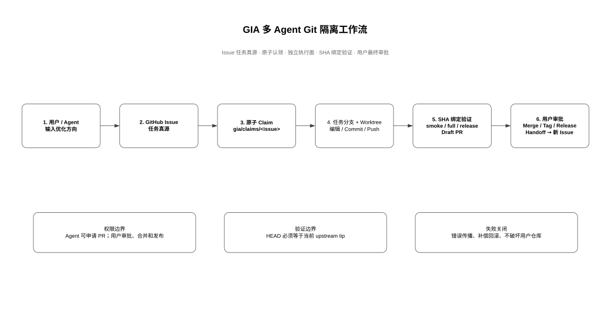

# Git Isolated Agent Kit（GIA Kit）

[](https://github.com/JiaxI2/git-isolated-agent-kit/actions/workflows/ci.yml)
[](https://github.com/JiaxI2/git-isolated-agent-kit/releases)
[](LICENSE)

一个独立、可移植的多 Agent Git 隔离开发工具包。它将网页版 GPT、Codex、Claude Code、CI 和人工开发者视为可替换执行器，由 Git/PR 负责隔离、审计、交接、验证与发布门禁。

## 核心原则

- 一个 Issue、一个任务分支、一个 PR。
- 单分支单写者；交接必须绑定 commit SHA。
- Agent 只能拥有任务分支，不能拥有主分支或发布权限。
- 云端修改与本地验证使用独立执行面。
- 本地验证默认使用 `git worktree`，不切换或污染稳定工作区。
- 自动化失败时默认停止，不执行 force push、hard reset 或强制清理。

## 工作流程



GIA 将优化方向转化为 GitHub Issue，通过原子 Claim 和独立 Worktree 建立
单写者执行面；提交推送后绑定远端 SHA 完成验证，再由 Agent 申请 Draft PR，
最终审批、合并、Tag 和 Release 始终归用户所有。

当前架构演进阶段为 **V2.1**。演进号只用于 README 与 CHANGELOG 的人类可读
说明；目录、包名、代码标识符和运行态数据保持无版本命名，避免把内部迭代号
固化成扩展边界。

该架构图由 Microsoft Visio 基于 Diagram IR 工程化绘制；流程块与治理块
全部采用无填充样式。可编辑源文件见
[gia-workflow.vsdx](docs/assets/gia-workflow.vsdx)，可复现定义见
[gia-workflow.diagram.json](docs/assets/gia-workflow.diagram.json)，PNG 预览见
[gia-workflow.png](docs/assets/gia-workflow.png)。

## 5 分钟开始

### Windows

```powershell
.\scripts\bootstrap.ps1
$env:PATH = "$(Resolve-Path .\bin);$env:PATH"
gia help
gia init --repo C:\path\to\repo
# 或：gia init --repo C:\path\to\repo --format yaml
gia doctor --repo C:\path\to\repo
```

### Linux/macOS

```bash
./scripts/bootstrap.sh
export PATH="$(pwd)/bin:$PATH"
gia help
gia init --repo /path/to/repo
# or: gia init --repo /path/to/repo --format yaml
gia doctor --repo /path/to/repo
```

目标仓库需要安装并登录：

```bash
gh auth login
```

`init` 默认生成 `.gia/config.json`，也可通过 `--format yaml|yml` 选择
对应格式。成功后会明确列出下一步：检查实际配置文件，然后选择将 `.gia/`
提交给团队，或将其加入目标仓库的 `.gitignore`；随后运行 `doctor`。

默认身份策略是 `shared-user + owner-merge`：本地 Agent 复用当前 `gh` 用户，
GitHub 不要求该用户审批自己的 PR，仓库所有者以最终 merge 作为人工确认。
如果 Agent 使用独立 GitHub App 或团队账号，可改为
`github-app + required-review` 或 `team + required-review`。`doctor` 会核对实际
GitHub actor、仓库 owner 和默认分支的有效 ruleset，身份或审批规则不一致时
失败关闭。

## 傻瓜式使用

用户只输入一个优化方向：

```powershell
gia issue create --repo F:\Project\Demo --direction "收敛安装和升级流程，减少重复 PowerShell"
```

GIA 自动：

1. 推断风险等级；
2. 生成包含目标、非目标、验收、回滚和执行边界的 Issue；
3. 添加 `agent:ready`、`risk:*`、`executor:*` 标签；
4. 等待 Agent 扫描并认领。

Agent 获取任务：

```powershell
gia issue list --repo F:\Project\Demo
gia scan --repo F:\Project\Demo
gia claim --repo F:\Project\Demo --issue 123 --executor web-agent
git switch agent/web-agent/feat/123-issue-123
# 编辑任务文件后：
git status --short
git add path/to/changed-file
git commit -m "fix(scope): complete issue 123"
git push
gia pr request --repo F:\Project\Demo --issue 123 --executor web-agent
```

`claim` 会创建并推送任务分支，但不会替你切换当前工作区。复制 claim JSON 中
的 `branch` 值并执行 `git switch`，完成编辑、commit 和 push 后，再申请
Draft PR。若稳定工作区必须始终停留在 `main`，请在专用任务 clone 或
`git worktree` 中执行上述 switch/edit/commit/push 步骤。

`issue list` 与 `scan` 都查询打开且带有生效配置中 `issue.readyLabel` 的
Issue。若结果为空，JSON 输出仍保留 `data: []`，并在 `guidance` 中给出实际
查询条件、常见原因和恢复建议。

`pr request` 仅为已认领 Issue 创建 Draft PR。它要求当前任务分支已推送、
本地 HEAD 等于远端分支 tip、仓库干净、executor 被允许，并返回
`PENDING_USER_APPROVAL`。审批、merge、Tag 和 Release 仍由用户在 GitHub
规则保护下完成。

本地 Codex 隔离验证：

```powershell
gia worktree create --repo F:\Project\Demo --pr 45 --root F:\Project\Demo-worktrees
# 输出 head SHA 后：
gia validate --repo F:\Project\Demo-worktrees\pr-45 --profile full --expected-head <SHA>
```

需要在执行前审阅完整副作用时，可以先创建不可变 Plan。请求文件放在目标仓库
内，例如 `plan-request.json`：

```json
{
  "task": {
    "id": "123",
    "title": "Run governed validation",
    "state": "ready",
    "risk": "medium",
    "mode": "local"
  },
  "effects": [
    {
      "kind": "command",
      "command": "go",
      "args": ["test", "./..."],
      "requires": ["local.command", "local.test"]
    }
  ]
}
```

```powershell
$plan = gia plan create --repo F:\Project\Demo --input plan-request.json | ConvertFrom-Json
$id = $plan.data.id
gia plan show  --repo F:\Project\Demo $id
gia plan diff  --repo F:\Project\Demo $id
gia plan apply --repo F:\Project\Demo $id
```

Plan ID 是内容的 SHA-256；它绑定 repository、base HEAD、任务、effects、策略
决策、capabilities、配置摘要和执行模式。`create/show/diff` 不产生副作用，
`apply` 会在取得单次租约前后核对 HEAD 与配置。成功或失败后都不能再次执行。
计划、租约和结果保存在 Git common dir 的 `gia` 目录，不污染工作树；CLI、
MCP 和 [`pkg/sdk`](pkg/sdk) 共用同一应用语义。

交接：

```powershell
gia handoff --repo F:\Project\Demo --pr 45 --to local-agent --state LOCAL_VALIDATION --note "需要 Windows Full 验证"
```

反馈：

```powershell
gia feedback --repo F:\Project\Demo --category ux --message "worktree 路径提示仍不够直观" --pr 45
```

## 命令

| 命令 | 用途 |
|---|---|
| `help` / `--help` | 查看顶层或指定命令帮助 |
| `init` | 在目标仓库生成单一 `.gia/config.json|yaml|yml` |
| `doctor` | 检查 Git、GitHub CLI、认证、身份模式和审批 ruleset |
| `issue create` | 从一句优化方向创建结构化 Issue |
| `issue list` | 列出打开且带有 ready 标签的 Issue |
| `scan` | 查找 `agent:ready` Issue |
| `claim` | 认领 Issue、创建并推送独立分支、更新标签 |
| `pr request` | 为已认领 Issue 申请 Draft PR，等待用户审批 |
| `worktree create/remove` | 创建或安全移除隔离验证目录 |
| `validate` | 运行绑定 SHA 的 smoke/full/release 验证 |
| `plan create/show/diff/apply` | 创建、检查、对比并单次执行不可变 Plan |
| `handoff` | 在 PR 评论写入可审计交接块 |
| `status` | 查看分支、HEAD、清洁状态和 worktree |
| `feedback` | 将问题/建议记录到 `.gia/feedback` |
| `notify` | 控制台、Webhook 或自定义命令通知 |

## 自动执行模式

`.github/workflows/gia-agent-dispatch.yml` 提供安全的 Issue 检测入口。默认仅分类和产生执行请求，不授予任意代码写权限。实际云端 Agent 可通过 GitHub App、ChatGPT/Codex 云任务或其他执行器读取 `agent:ready` Issue。

手工触发时，`issue_number` 是可选输入。未提供编号时，工作流只输出安全摘要并成功结束，不读取不存在的 Issue payload，也不修改仓库或 Issue 状态；提供编号时，仅处理带有 `agent:ready` 标签的 Issue。

```powershell
gh workflow run gia-agent-dispatch.yml
gh workflow run gia-agent-dispatch.yml -f issue_number=123
```

推荐自动化等级：

- **A0 手动**：用户创建 Issue，人工选择执行器。
- **A1 半自动（默认）**：Issue 自动生成和分类，Agent 自动发现，人工批准认领。
- **A2 受控自动**：低风险任务自动认领，高风险任务要求批准。
- **A3 全自动**：不建议用于拥有发布、凭据、工作流或子模块写权限的仓库。

## 配置

初始化后编辑目标仓库中唯一的 `.gia/config.json`、`config.yaml` 或
`config.yml`：

- 自定义分支规则；
- 自定义 smoke/full/release 命令；
- 定义保护路径；
- 选择 `shared-user`、`github-app` 或 `team` 身份模式；
- 选择所有者合并确认或强制独立 Review；
- 配置通知 Webhook 或命令；
- 决定是否允许自动认领。

`issue`、`scan`、`claim`、`pr request`、`validate`、`plan`、`notify` 和 `doctor`
支持 `--config <path>` 显式选择配置；显式路径优先于 `.gia` 自动发现。解析会
拒绝 unknown fields，避免拼写错误导致策略静默失效。

详见 [配置说明](docs/CONFIGURATION.md)。
架构与增量迁移边界见 [架构说明](docs/ARCHITECTURE.md) 和
[迁移图](docs/MIGRATION.md)。

## 测试与持续迭代

详见 [测试方案](docs/TEST_PLAN.md)、[最终验证报告](docs/TEST_REPORT.md)、
[0.1.0 Release Notes](docs/RELEASE_NOTES_0.1.0.md) 和
[对抗式威胁模型](docs/THREAT_MODEL.md)。
贡献流程见 [CONTRIBUTING.md](CONTRIBUTING.md)，安全问题请按
[SECURITY.md](SECURITY.md) 私下报告。

## 当前边界

- GIA 不直接调用特定 AI 服务；执行器通过 Issue/PR 协议接入。
- GIA 不存储 GitHub Token，复用 `gh` 的认证。
- GIA CLI/runtime 不自动合并、打 Tag 或发布 Release；canonical release
  workflow 只响应用户已创建并推送的版本 Tag。
- GIA 不绕过 GitHub 分支保护。
- `shared-user` 模式下 Agent 与用户共享同一 GitHub actor，所有者 merge 只是
  人工流程门禁，不是硬身份隔离；需要正式网页审批时必须使用 `github-app`
  或 `team` 模式，并由独立 GitHub App/token 和 ruleset 建立真实边界。
- 默认配置的验证命令是 Go 仓库示例，目标项目应按技术栈调整。
